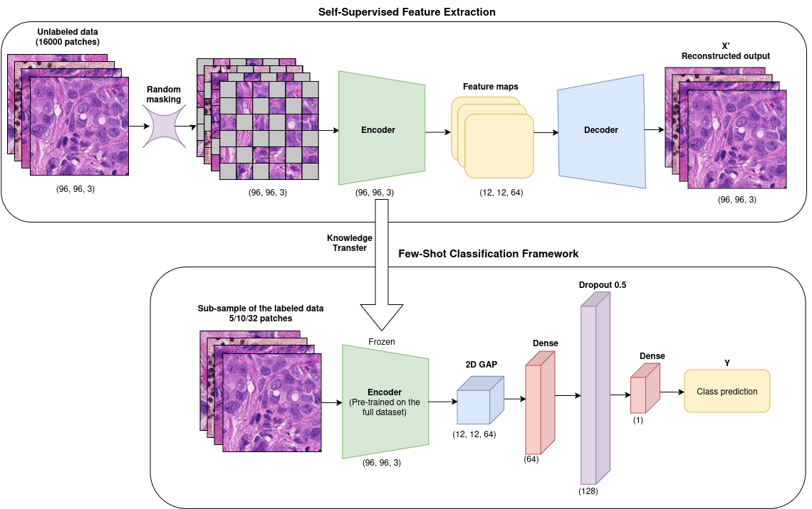
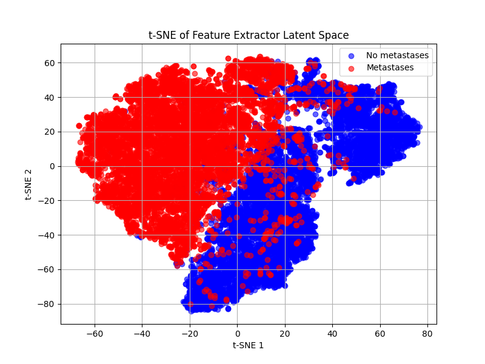
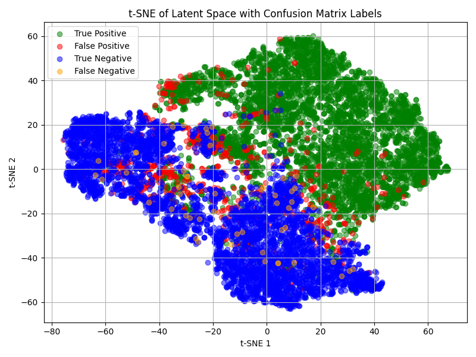
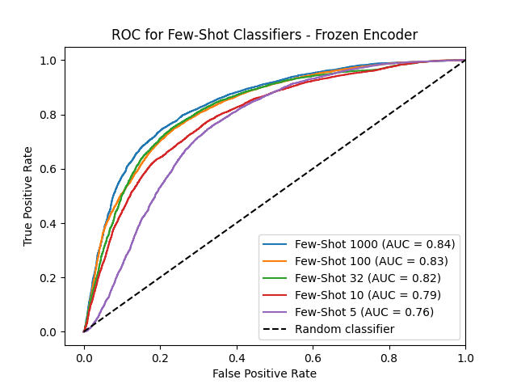
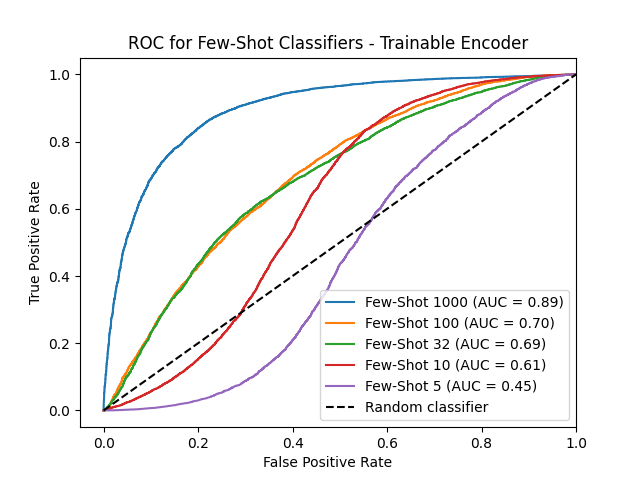
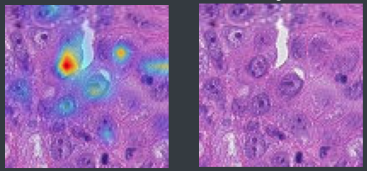
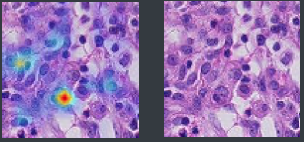
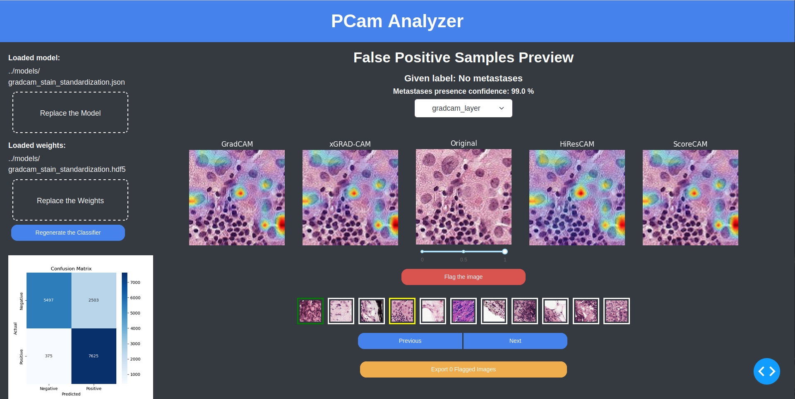

# 8P361 Project AI for Medical Image Analysis

## Locally Trainable Few-Shot Classifier with Grad-CAM to Flag Potentially Missed Lymph Node Metastases in Breast Cancer Patients
Deep learning models trained on heterogeneous datasets may suffer from over-generalization when deployed locally on data subjected to uniform preprocessing. In the context of histological image analysis, this can lead to misclassifications of metastases, resulting in sub-optimal treatment decisions. This work presents a few-shot learning binary classifier of metastases presence in the sentinel lymph nodes tissue preparations of breast cancer patients, incorporating self-supervised feature extraction using masked autoencoders. This approach enables local histological laboratories to train their custom feature extractor using unlabeled dataset subjected to their own preprocessing protocol. The features learned through this self-supervised method are then utilized in transfer learning for the few-shot classifier, which significantly reduces the number of manually annotated samples required for the classifier's training, while still surpassing the baseline performance set by a panel of human histopathologists. To demonstrate that the classifier relies on the image features, and it is robust to potentially noisy labels, the model was optimized during the training to heavily penalize false negative classifications and focus especially on identifying potentially missed (false positive) metastases in the samples. Gradient Class Activation Mapping (Grad-CAM) flavored heatmaps applied to the final convolutional layer of the feature extractor visually highlight potential metastases in the images of clinically negative samples. Furthermore, a PCam Analyzer graphical user interface is provided, enabling clinicians to inspect the samples with potentially overlooked metastases sorted by model's prediction confidence for a second opinion guided by Grad-CAM visualisation.

### Aims of this work

1. Propose a custom self-supervised masked autoencoder framework for discriminative feature extraction of tissue instances with and without metastases.
2. Transfer the extracted features into a supervised binary classifier and experimentally find the lowest number of labeled instances required for training to still surpass the baseline performance given by panel of human histopathologists.
3. Demonstrate that the classifier relies on the image features, and it is robust to potentially noisy labels by identifying potentially missed metastases in the samples.  
4. Apply Grad-CAM heatmaps after the feature encoder to visually highlight metastases of clinically negative samples.
5. Develop PCam Analyzer graphical user interface enabling clinicians to inspect the samples with potentially overlooked metastases sorted by the model's prediction confidence for a second opinion guided by Grad-CAM visualisation.


### Methods



#### Dataset
1. Download and unpack PCam dataset from https://github.com/basveeling/pcam. The structure should correspond to the file tree below:

```
.
├── test
└── train+val
    ├── train
    │   ├── 0
    │   └── 1
    └── valid
        ├── 0
        └── 1
```

2. Set the path to the dataset in `few_shot_classifier/config.py`

#### Installing dependencies
```
python3 -m pip install -r requirements.txt
```

#### Masked autoencoder training
```
cd few_shot_classifier
python3.8 -m feature_extractor.masked_encoder --epochs 50 --output ../models/mae_encoder
```

The output consisting of model architecture in `.json` format 
and weights in `.hdf5` format can be found in the directory and file prefix 
specified via `--output` option in the command above.

#### Generating average input subsets for few-shot classifier
```
cd few_shot_classifier
python3 -m cross_validation.cross_validation
```

#### Few-Shot classifier training
```
cd few_shot_classifier
python3 -m few_shot_training.training
```

#### Latent space plotter
```
cd few_shot_classifier
python3 -m latent_space_plotter.latent_space_plotter
```

#### ROC curve plotter
```
cd few_shot_classifier
python3 -m roc_curve_plotter.roc_curve_plotter
```

#### Generating false positive classifications
```
cd few_shot_classifier
python3 -m generate_false_positives.generate_false_positives
```

### Results
#### Feature Extraction
Figure below shows the latent space 
representation of the encoder part of the classifier using t-SNE algorithm. 
The plot indicates a good separability of the features between the negative
(no metastases) and positive (metastases) clusters.


Figure below additionally depicts a distinction
between model's correct and incorrect classification with more samples 
belonging to the false positive category than the false negative, 
as was intended for this application. 



#### Few-Shot Classifier
Table I summarizes the classifier's performance under training conditions with a fully labeled dataset and 
average-performing subsets of 5, 10, 32, 100 and 1000 labeled instances per class, 
comparing scenarios with both frozen and trainable encoder configurations. 
Input images were sampled from the validation portion of the PCam dataset containing 16000 images. 
Additionally, models were submitted to the [Kaggle platform](https://www.kaggle.com/competitions/histopathologic-cancer-detection) to validate their performance on an unseen test set.

| Classifier       | Encoder    | AUC  | Kaggle AUC |
|------------------|------------|------|------------|
| Full classifier  | trainable  | 0.99 | 0.95       |
| Full classifier  | frozen     | 0.82 | 0.81       |
| Few-Shot 1000    | frozen     | 0.84 | 0.84       |
| Few-Shot 1000    | trainable  | 0.89 | 0.87       |
| Few-Shot 100     | frozen     | 0.83 | 0.82       |
| Few-Shot 100     | trainable  | 0.70 | 0.60       |
| Few-Shot 32      | frozen     | 0.82 | 0.84       |
| Few-Shot 32      | trainable  | 0.69 | 0.60       |
| Few-Shot 10      | frozen     | 0.79 | 0.80       |
| Few-Shot 10      | trainable  | 0.61 | 0.52       |
| Few-Shot 5       | frozen     | 0.76 | 0.73       |
| Few-Shot 5       | trainable  | 0.45 | 0.42       |

Figures below depict the ROC for the few-shot experiments 
of 5, 10, 32, 100 and 1000 samples. A model trained on 5 image 
instances per class with weights transferred from the feature 
extraction task achieves an AUC of 0.76 compared to an AUC of just 0.45 when the encoder's weights are trainable. 





#### Grad-CAM heatmaps
Grad-CAM generated heatmaps were first applied on the true positive samples to validate whether the model 
can detect the metastases in the central 32x32 px region. A sample result can be seen in 
Figure below. The prediction score is encoded in a 'jet' colormap with red corresponding to
the highest confidence and dark blue corresponding to the lowest confidence. 



Figure below depicts one of the samples annotated as without metastases but with high prediction confidence of their presence. The detected metastases are outside the central region and hence the ground truth label could not be influenced by them.



### PCam Analyzer GUI
PCam Analyzer graphical user interface was built in Python on the DASH framework. The Grad-CAM, xGRAD-CAM, High resolution CAM and ScoreCAM variations are provided for comparison as well as the option
for user to select convolutional layer for which the Grad-CAM is generated.

#### Running PCam Analyzer
```
cd pcam_analyzer
python3 app.py
```
After initialization, the app shall be available at http://127.0.0.1:8050/.




